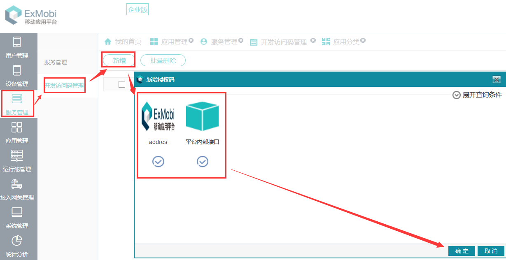
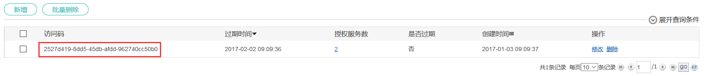

# 应用接入

----------
<h2 id="cid_0">ExMobi应用接入</h2>

<h3 id="cid_0_0">申请开发访问授权码</h3>  

登录EXMOBI平台管理界面，在对应的菜单【服务管理-开发访问码管理】点击新增,选择需要访问的服务生成开发访问授权码。  

   

   

<h3 id="cid_0_1">全局环境变量定义及微服务鉴权工具类AccessAuthUtil使用示例</h3>  

ExMobi客户端有封装了一个微服务鉴权工具类AccessAuthUtil（见《ExMobi客户端二次开发手册》12.22章节），建议在开发ExMobi应用时，在js里对全局使用的环境变量进行统一定义，方便维护和全局调用，同时对微服务鉴权工具类 (AccessAuthUtil)进行封装便于快捷调用。 

封装示例代码如下，在ExMobi应用中定义一个外部javascript文件“fhsdk.js”，开发者可以在实际开发过程中根据项目实际需求进行自定义封装：

```javascript
/**
 * 平台接入封装
 * accessCode：访问接入授权码  【注：开发者请替换成自己的访问码】
 * serverUrl：平台接入服务端http协议接入地址【注：开发者请替换成自己搭建的平台http协议访问地址】
 * serverUrl_https：平台接入服务端https协议接入地址【注：开发者请替换成自己搭建的平台https协议访问地址】
 * init：SDK初始化
 * exec：SDK获取token，并执行回调方法同时传递token值
 */
var fhsdk = {
	"accessCode" : "2527d419-8dd5-45db-afdd-962740cc50b0",
	"serverUrl" : "http://192.168.160.159:8090",
	"serverUrl_https" : "http://192.168.160.159:7443",
	init : function() {
		//该方法为SDK初始化操作
		var jsonData = {};
		jsonData.accessCode = this.accessCode;
		AccessAuthUtil.init(jsonData);
	},
	exec : function (func) {
		//调用初始化
		if (!this.isinit) {
			this.init();
			this.isinit = true;
		}   
		//获取访问码，调用回调方法
		var jsonData = {};
		jsonData.url = this.serverUrl_https + "/api/getAccessToken";
		AccessAuthUtil.getToken(jsonData, func);
	}
};
```  

<h3 id="cid_0_2">平台接口调用示例</h3>  

参照[ExMobi-server6.x平台接口定义章节](https://gitdocument.exmobi.cn/exmobi6-server-access-guide/access_define.html)根据平台接口协议进行调用对应的接口；

以下为一个平台用户登录鉴权调用示例（在页面中引入了上一小节定义的fhsdk.js）：

```html
<!DOCTYPE html PUBLIC "-//W3C//DTD XHTML 1.1//EN" "http://www.nj.fiberhome.com.cn/exmobi.dtd">
<html>
	<head>
		<title show="false"/>
		<script type="text/javascript" src="res:script/exmobi_lite/core.js"></script>
		<script type="text/javascript" src="res:script/fhsdk.js"></script>
		<script type="text/javascript">
			<![CDATA[
			function login(json) {
				var ajaxData = {};
				ajaxData.method = "GET";
				ajaxData.isBlock = false;
				ajaxData.url = fhsdk.serverUrl_https + '/api/auth';
				ajaxData.data = 'access_token=' + json.token + '&version=1.0&appid=' + ClientUtil.getAppId() + '&device=' + DeviceUtil.getEsn() + '&user_account=' + $('#username').val() + '&password=' + $('#password').val();
				ajaxData.exmobiHeader = true;
				ajaxData.successFunction = "succfunc";
				ajaxData.failFunction = "failfunc";
				var ajax = new DirectAjax(ajaxData);
				ajax.send();
			}

			function succfunc(directAjax) {
				var data = eval("(" + directAjax.responseText + ")");
				if (data.errcode == 0) {
alert("登录成功");
				} else {
					alert("用户名或密码错误！");
				}
			}

			function failfunc() {
				alert("登录异常");
			}

			]]>
		</script>
	</head>
	<body style="background-color:white;padding:0 10;">
		<form id="form" method="post">
			<br size="120"/>
			
			<br size="40"/>
			<div class="card">
				<input id="username" type="text" prompt="请输入用户名" licon="res:image/login3/user.png"/>
				<hr/>
				<input id="password" type="password" prompt="请输入密码" licon="res:image/login3/pwd.png"/>
			</div>
			<input type="button" value="登录" onclick="fhsdk.exec(login)" />
			<br size="5"/>
		</form>
	</body>
</html>

```

<h2 id="cid_1">原生应用接入</h2>  

<h3 id="cid_1_0">申请开发访问授权码</h3>  

请参考[申请开发访问授权码章节](https://gitdocument.exmobi.cn/exmobi6-server-access-guide/app_access.html#cid_0_0)

<h3 id="cid_1_1">集成微服务鉴权SDK</h3>  

请参考[微服务鉴权SDK集成章节](https://gitdocument.exmobi.cn/exmobi6-server-access-guide/authsdk.html)

<h3 id="cid_1_2">平台接口调用示例</h3>  

首先：调用微服务鉴权SDK相关章节中的API进行初始化配置。  

其次：参照[ExMobi-server6.x平台接口定义章节](https://gitdocument.exmobi.cn/exmobi6-server-access-guide/access_define.html)根据平台接口协议进行调用对应的接口。
