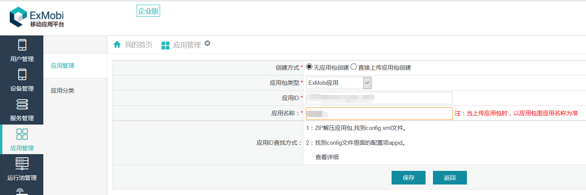
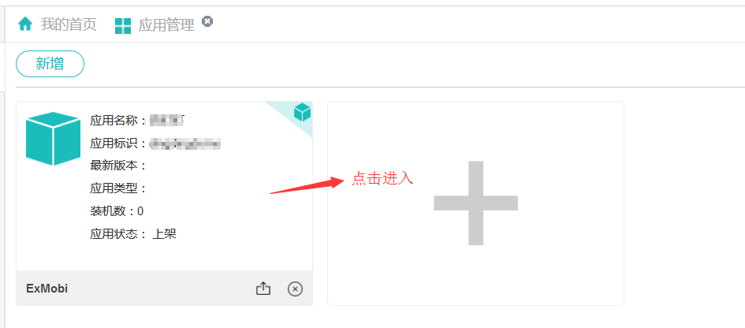
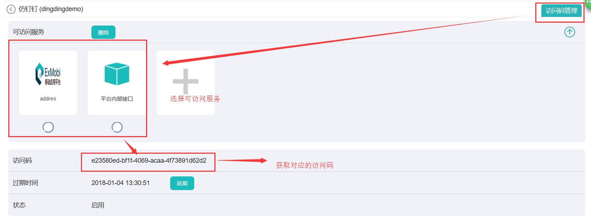
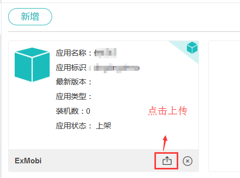
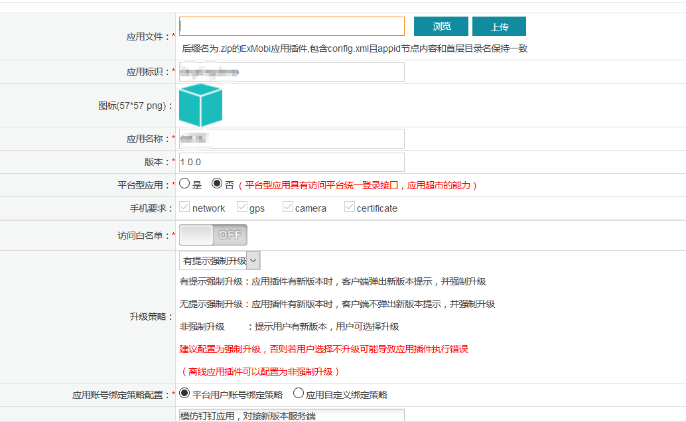
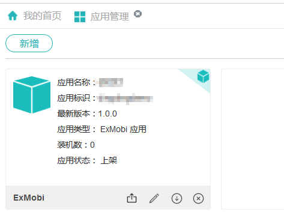
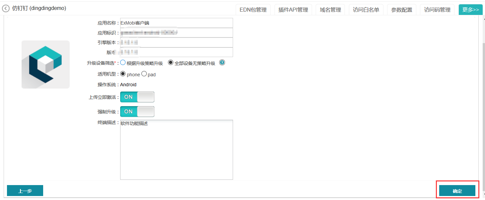
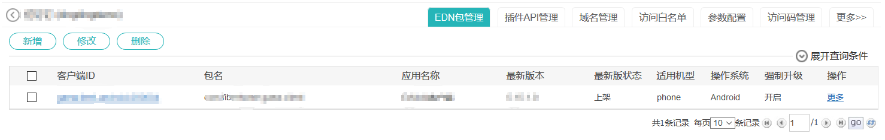

# 应用发布

----------
<h2 id="cid_0">ExMobi应用</h2>

<h3 id="cid_0_0">创建无包应用，申请访问授权码</h3>  

登录EXMOBI平台管理界面，在对应的菜单【应用管理】新建应用，并生成访问授权码：  

   

   

   

<h3 id="cid_0_1">替换全局变量</h3>  

将之前ExMobi应用开发过程中定义的存放全局变量的外部javascript文件内的开发访问授权码替换成正式的访问授权码，以及相关访问地址替换成正式的访问地址。 

<h3 id="cid_0_2">上传ExMobi应用插件包</h3>  

将替换后的ExMobi应用插件工程从开发工具Mbuilder导出成ExMobi应用插件包上传  

  

  

  

<h3 id="cid_0_2">上传打包应用安装包</h3>  

点击上面的应用包进入应用详情进行EDN管理，上传通过EDN打包或者是Mbuilder打包生成的移动应用安装文件，在EDN或者Mbuilder内打包过程见此教程[ExMobi应用插件打包](https://edu.exmobi.cn/learn/z7J3VEflql1WMinP)。

    

    

  

<h2 id="cid_1">原生应用(Android应用，IOS企业应用，iOS Appstore)</h2>  

<h3 id="cid_1_0">创建无包应用，申请访问授权码</h3>  

操作步骤请参考[ExMobi应用的无包创建及申请访问授权码](https://gitdocument.exmobi.cn/exmobi6-server-access-guide/app_deploy.html#cid_0_0)流程，选择应用类型时请选择Android应用，IOS企业应用或iOS Appstore其中一种。 

<h3 id="cid_1_1">替换全局变量</h3>  

将开发过程中使用的开发访问授权码换成正式的访问授权码，将相关访问地址换成正式的访问地址。  

<h3 id="cid_1_2">上传原生应用包</h3>  

Android应用，IOS企业应用上传打包好的apk或ipa文件接口，对于iOS Appstore应用配置相应的在Appstroe的发布地址。 

