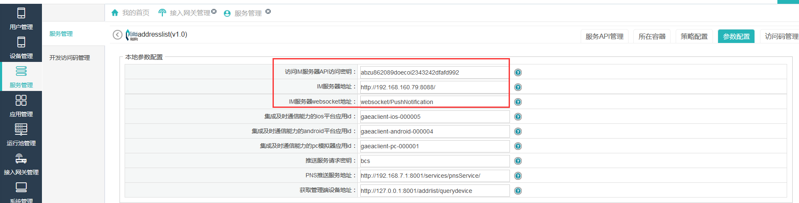

# IM能力开发

----------

平台提供了IM集成开发能力，开发者可以通过平台接口，通信录服务接口，IM接口实现IM通信功能。  

<h2 id="cid_0">准备工作</h2>  

* IM服务的安装，安装配置请参照相关IM服务安装文档。  

* 通讯录服务配置，打开菜单【服务管理】下通讯录服务addresslist进行IM参数配置，IM参数配置信息请与IM安装目录下config.xml配置文件中的信息保持一致。    

   

<h2 id="cid_1">集成开发步骤</h2>  

1.获取IM服务器的相关变量，见im服务安装目录下的config.xml文件：  

```javascript
var IMConfig = {
	"im_ip":"192.168.160.79",
	"im_port":"8088",
	"im_sslPort":"8089",
	"im_isSsl":"0",
	"im_isSound":"0",
	"im_isVibrate":"0",
	"im_iconurl":""
};

```   

2.调用平台登录鉴权接口，获取当前用户的IM账号信息。  
  
3.调用通讯录相关接口，获取组织架构及每个人员的IM账号信息，参照《ExMobi客户端二次开发文档》相关章节：   

> 7.4 <fhimchat>烽火单聊控件  
> 7.5 <fhimgroupchat>烽火IM群聊控件  
> 7.6 <fhimlist>烽火IM列表  
> 12.20 FhImUtil烽火IM工具类  